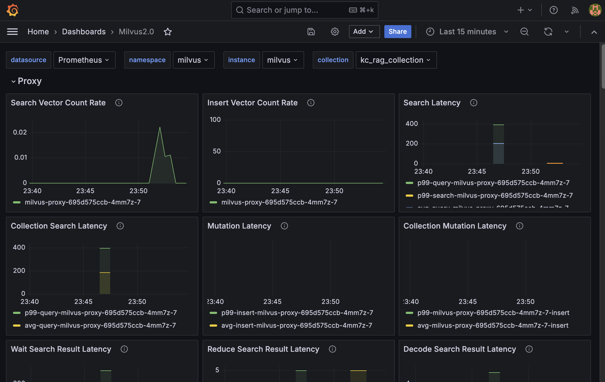
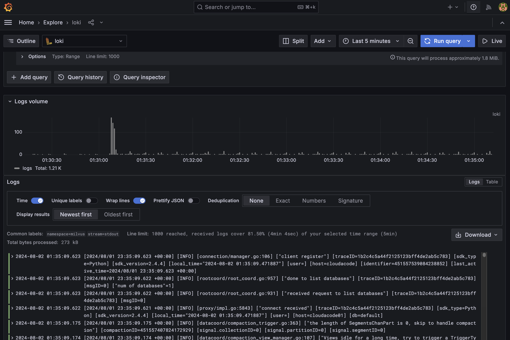

# Milvus on GKE with Monitoring stack

[Milvus](https://milvus.io/docs/overview.md) on GKE with essential Kuberentes tools including ingress-nginx, prometheus, loki, and grafana.

## Provision the infrastructure

**NOTE**: this environment requires around 1TB of disk space, so please increase the Persistent Disk SSD (GB) quota to 2TB before applying terraform.

To deploy new GKE cluster, need to update the `local_variables.tf` file with the appropriate values and then execute below:

1. `cd k8s-app/infrastructure`

2. Edit `local_variables.tf` to set your project ID, location, prefix_name, etc.

3. Run `terraform init`

4. Run `terraform plan` to simulate the changes

5. Run `terraform apply`

It may take up to 30 minutes.

## Generate vector embeddings for the dataset

Once the cluster is ready, open the [milvus-embedding.ipynb](./milvus-embedding.ipynb) notebook and execute each cell sequentially.

**NOTE:** To access the Milvus cluster remotely, establish a session using port forwarding.

```bash
kubectl port-forward svc/milvus -n milvus 19530
```

## Monitoring

### Metric

By default, Prometheus and Loki will be installed, and you can use Grafana to access the dashboard.

```bash
kubectl port-forward svc/prometheus-grafana 8080:80
```

Log in to the Grafana dashboard(http://127.0.0.1:8080) with `admin:prom-operator` and open the Milvus2.0 dashboard.



### Logs

Since Loki is installed, you can also explore the logs via the Grafana dashboard.

Navigate to `Connections > Add New Connection > Loki > Add New Datasource`, enter the Loki URL as `http://loki-gateway`, save the connection, and then explore the logs.



## Future items

- Implement Ray to distribute embedding tasks across multiple nodes, accelerating the training process and enabling the handling of larger datasets.
- Implement Argo Workflow, a workflow engine for orchestrating parallel jobs on Kubernetes and automating pipelines.
